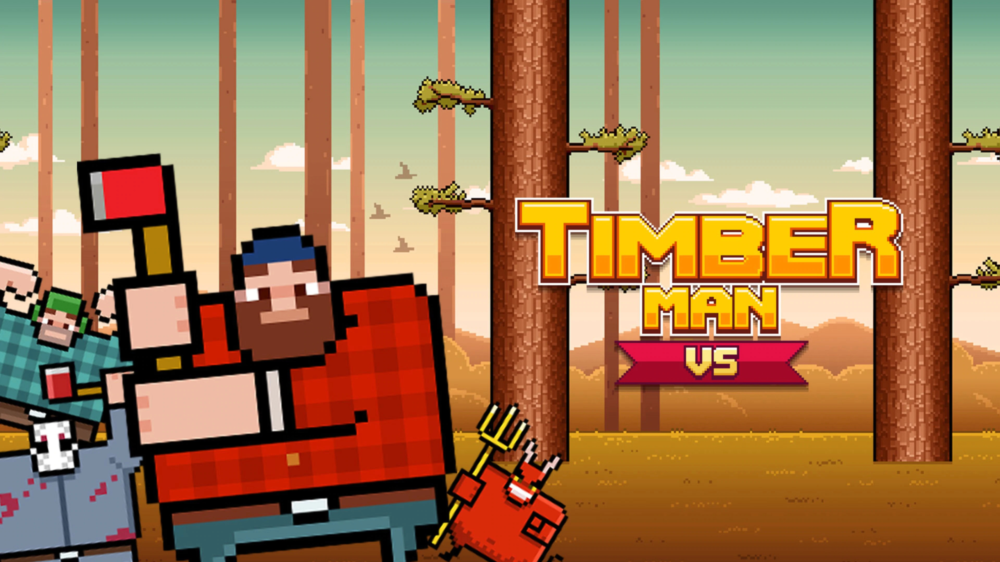

# [Timberman](https://realnarukyn.github.io/timberman-ts/)

<p align="center">
  
</p>

## Technologies

I tried to use the minimun amount of dependencies as posible because I like to write code... :)

- npm
- Typescript
- Eslint
- Prettier
- Parcel

_And I don't really think that I need more dependencies or modules_

## Setting Up The Project!

To download and start the project you need to run the following commands:

1 - Clone the project into your local pc

```bash
git clone https://github.com/RealNarukyn/timberman-ts.git
```

2 - Move into it

```bash
cd timberman-ts
```

3 - Install all the necessary dependencies (_you can check them in the package.json_)

```bash
npm install
```

## Commands Availables

Once you've set up the project you're ready to run develop or test the game! Here there are different options.

- Start the project with the build data _(removes build folder -> builds game -> starts build)_

  ```bash
  npm start || npm run start
  ```

- Start the project in develop mode _(runs typescript files)_

  ```bash
  npm run dev
  ```

- Build the game _(removes build folder -> builds game)_

  ```bash
  npm run build
  ```

- Apply Prettier-Format _(runs prettier formatter to all files inside src folder)_

  ```bash
  npm run prettier-format
  ```

## Deployment

In case you're thinking about making a deployment you need to:

1. Create a new build with all the changes you've done.

   _You'll get direct points to my heart if you format the code before_

2. If you were working in a different branch from main _(well done✔️✔️)_ merge the changes to the main branch.

   In case you were working directly on the main branch _(baad!!❌❌)_ you're a psycho killer, a sith, a very very bad person, the worst of your kind... But anyway 

3. Do a push from your local main branch to the remote.

4. Grab your holy book (in @amargopastor case I think it's CleanCode...)

5. And finally... **PRAY!**

6. If everything went right you can check your changes [here](https://realnarukyn.github.io/timberman-ts/)!

## Requeriments

I'm not translating the whole _"Requerimientos"_ part I'm even minding if I should put it into this beautifull readme...

- El juego estará desarrollado en HTML Canvas Graphics Juego
- Trabajaremos sobre un entorno de Node.js
- Deberemos incluir las instrucciones o descripción del objetivo del juego
- El 50% de nuestros ficheros, mínimo, estarán en formato Typescript
- Está permitido el uso de librerias de utilidades como: lodash, ramda, luxon o momentjs
- El usuario debe poder interactuar con el juego mediante la detección de acciones sobre las teclas del teclado
- El juego debe poseer un indicador de rendimiento en frames por segundo
- Se mantendrá en todo momento un ratio de 60fps/seg
- Quedará registrado un evento durante el flujo normal del juego en el momento en que dos o más actores colisionen
- Entregar el juego en github pages <usuario>.github.io/<repositorio>
- Desplegar el juego en github pages compilandolo con parcel

## License

I don't feel important enought to even have a License so here are only my thoughts but I just copied the License.md from another project.

## Honorable mentions

- Thanks to [@spritekitbook](https://github.com/spritekitbook/timberman-swift), the project I took the resources from.
- Thanks to my mom who said that I can full-time work and study at the same time and now I'm losing my hair.
